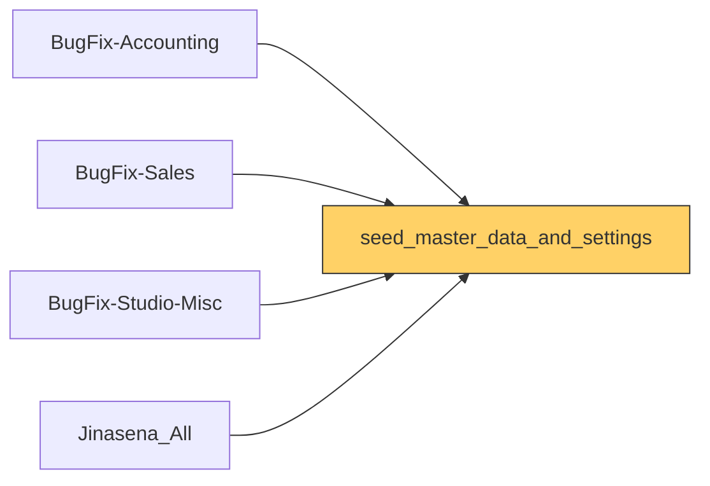

# Functional Documentation — seed_master_data_and_settings

> Generated by `scripts/generate_functional_docs.py` from branch `Visual_Migration_02` (commit b513e72 2026-10-08) and the installed module on the clean environment. For every attribute: **Function** = what it does, **Depends on** = the attributes it relies on (owning module in brackets when it is not this repo), **Used by** = the attributes in any Jinasena repo that rely on it.

| Item | Value |
|---|---|
| Technical name | `seed_master_data_and_settings` |
| Title | Jinasena : Masterdata : Setup Data |
| Version | `17.0.1.0.12` |
| Category | Tools |
| License | LGPL-3 |
| Installed on environment | installed 17.0.1.0.12 |
| History | [CHANGELOG.md](CHANGELOG.md) |

## Purpose

<!-- SUMMARY:repo -->
seed_master_data_and_settings bootstraps a fresh Odoo 17 Enterprise database (dev, staging or restore) with the Jinasena master-data layout taken from the Clear-DB production snapshot. It is an administrator setup module with no models of its own; it loads companies and users through XML data and finishes the work in a post-install hook. It is additive: existing companies and users on the target are not touched, and all records use stable xmlids. Other Jinasena repos (BugFix-Accounting, BugFix-Sales, BugFix-Studio-Misc) depend on it, for example to reference the seeded companies.

- Companies: Jinasena (Pvt) Ltd., Jinasena Agricultural Machinery (Pvt) Ltd. and JLTD, with their partners; existing internal users are granted access to them so they appear in the company switcher.
- Users: about 35 seeded users and partners (branch, finance, sales and stores staff) set to a shared temporary password that must be rotated after install.
- Per-user data: signatures, images, groups and Studio fields applied from a bundled Clear-DB snapshot (data/user_data.json), matched by login.
- Fix-repair settings: Studio repair flags on warehouse stock locations and the factory repair location parameter for Jinasena Agricultural Machinery (PW-JM/Stock), only when Fix-repair is installed.
- Portal confirmation: signature required, online payment not required, on companies and existing sale orders.
- Warehouses are no longer seeded since 17.0.1.0.12; they are treated as environment data.
<!-- /SUMMARY -->

## Module dependencies

| Kind | Modules |
|---|---|
| Odoo standard / enterprise | `base`, `stock`, `hr`, `mail` |
| Jinasena repos |  |
| Third-party apps |  |
| Used by (Jinasena repos that depend on this one) | `BugFix-Accounting`, `BugFix-Sales`, `BugFix-Studio-Misc`, `Jinasena_All` |

## Contents at a glance

| Attribute type | Count |
|---|---|
| Install hooks | 8 |
| Migration scripts | 9 |

## Models

_None._

## Data records loaded (76)

Records this module creates on install (lookup values, sequences, defaults, companies, users …).

| Type | Record name | Function | Depends on | Used by |
|---|---|---|---|---|
| `res.company` | `company_jinasena_pvt_ltd` | Seed record **Jinasena (Pvt) Ltd.** loaded on install. |  |  |
| `res.company` | `company_jinasena_agricultural_machinery` | Seed record **Jinasena Agricultural Machinery (Pvt) Ltd.** loaded on install. |  |  |
| `res.company` | `company_jltd` | Seed record **JLTD** loaded on install. |  |  |
| `res.partner` | `partner_1` | Seed record **Jinasena (Pvt) Ltd.** loaded on install. |  |  |
| `res.partner` | `partner_87` | Seed record **Jinasena Agricultural Machinery (Pvt) Ltd.** loaded on install. |  |  |
| `res.partner` | `partner_511` | Seed record **JLTD** loaded on install. |  |  |
| `res.partner` | `partner_3` | Seed record **Rohana Balagalla** loaded on install. |  |  |
| `res.partner` | `partner_10` | Seed record **Kapila Hettiarachchi - New 17** loaded on install. |  |  |
| `res.partner` | `partner_11` | Seed record **Shehan De Silva** loaded on install. |  |  |
| `res.partner` | `partner_27` | Seed record **Milinda Bakmiwewa** loaded on install. |  |  |
| `res.partner` | `partner_29` | Seed record **Janitha Chamath Ranasinghe** loaded on install. |  |  |
| `res.partner` | `partner_448` | Seed record **Tharaka Herath** loaded on install. |  |  |
| `res.partner` | `partner_473` | Seed record **Chandika Rathnayake** loaded on install. |  |  |
| `res.partner` | `partner_1585` | Seed record **Stores Manager** loaded on install. |  |  |
| `res.partner` | `partner_6212` | Seed record **HR UAT** loaded on install. |  |  |
| `res.partner` | `partner_6705` | Seed record **Kamani Ekanayaka BR-KA** loaded on install. |  |  |
| `res.partner` | `partner_6706` | Seed record **Jayani Tharangi - Finance** loaded on install. |  |  |
| `res.partner` | `partner_6707` | Seed record **Himesha Bandara Rajaguru** loaded on install. |  |  |
| `res.partner` | `partner_6708` | Seed record **Sethmini Prasansa - BR-AM** loaded on install. |  |  |
| `res.partner` | `partner_6709` | Seed record **Shanika Hansamali - BR-AN** loaded on install. |  |  |
| `res.partner` | `partner_6710` | Seed record **Maheshika Karunarathna BR-AV** loaded on install. |  |  |
| `res.partner` | `partner_6711` | Seed record **Rashmi Tanya - BR-BE** loaded on install. |  |  |
| `res.partner` | `partner_6712` | Seed record **Chathurika Dilshani - BR-BU** loaded on install. |  |  |
| `res.partner` | `partner_6713` | Seed record **Sampath Suwandirakkarage - BR-DA** loaded on install. |  |  |
| `res.partner` | `partner_6714` | Seed record **Samadi Silva - BR-EK** loaded on install. |  |  |
| `res.partner` | `partner_6715` | Seed record **Prema Ranjani Rajapaksha - BR-EM** loaded on install. |  |  |
| `res.partner` | `partner_6716` | Seed record **PW Nilusha Priyangika BR-GA** loaded on install. |  |  |
| `res.partner` | `partner_6717` | Seed record **Sinthuja Srikanth - BR-JF** loaded on install. |  |  |
| `res.partner` | `partner_6718` | Seed record **Nipuni Lakmali Rathnayake - BR-KU** loaded on install. |  |  |
| `res.partner` | `partner_6719` | Seed record **Charindu Rusith Thirimanne - BR-KU** loaded on install. |  |  |
| `res.partner` | `partner_6720` | Seed record **Achala De Silva - Finance** loaded on install. |  |  |
| `res.partner` | `partner_6721` | Seed record **Roshini Anandam BR-NE** loaded on install. |  |  |
| `res.partner` | `partner_6722` | Seed record **Sherin Dilani - Finance** loaded on install. |  |  |
| `res.partner` | `partner_6723` | Seed record **Dilum Iranjan Hewagamage - Sales** loaded on install. |  |  |
| `res.partner` | `partner_6724` | Seed record **Inoka Priyadarshani - Sales** loaded on install. |  |  |
| `res.partner` | `partner_6725` | Seed record **Apsara Madubashini - BR-KU** loaded on install. |  |  |
| `res.partner` | `partner_6726` | Seed record **Chaminda Bandara - BR-DA** loaded on install. |  |  |
| `res.partner` | `partner_6727` | Seed record **Sahan Fernando - BR-EK** loaded on install. |  |  |
| `res.partner` | `partner_6750` | Seed record **Sanjaya Weerasingha** loaded on install. |  |  |
| `res.partner` | `partner_7442` | Seed record **ABC** loaded on install. |  |  |
| `res.partner` | `partner_7445` | Seed record **Branch User for Odoo Tresting** loaded on install. |  |  |
| `res.users` | `user_2` | Seed record **Rohana Balagalla** loaded on install. |  |  |
| `res.users` | `user_8` | Seed record **Kapila Hettiarachchi - New 17** loaded on install. |  |  |
| `res.users` | `user_9` | Seed record **Shehan De Silva** loaded on install. |  |  |
| `res.users` | `user_24` | Seed record **Milinda Bakmiwewa** loaded on install. |  |  |
| `res.users` | `user_25` | Seed record **Janitha Chamath Ranasinghe** loaded on install. |  |  |
| `res.users` | `user_146` | Seed record **Tharaka Herath** loaded on install. |  |  |
| `res.users` | `user_164` | Seed record **Chandika Rathnayake** loaded on install. |  |  |
| `res.users` | `user_638` | Seed record **Stores Manager** loaded on install. |  |  |
| `res.users` | `user_643` | Seed record **HR UAT** loaded on install. |  |  |
| `res.users` | `user_723` | Seed record **Kamani Ekanayaka BR-KA** loaded on install. |  |  |
| `res.users` | `user_724` | Seed record **Jayani Tharangi - Finance** loaded on install. |  |  |
| `res.users` | `user_725` | Seed record **Himesha Bandara Rajaguru** loaded on install. |  |  |
| `res.users` | `user_726` | Seed record **Sethmini Prasansa - BR-AM** loaded on install. |  |  |
| `res.users` | `user_727` | Seed record **Shanika Hansamali - BR-AN** loaded on install. |  |  |
| `res.users` | `user_728` | Seed record **Maheshika Karunarathna BR-AV** loaded on install. |  |  |
| `res.users` | `user_729` | Seed record **Rashmi Tanya - BR-BE** loaded on install. |  |  |
| `res.users` | `user_730` | Seed record **Chathurika Dilshani - BR-BU** loaded on install. |  |  |
| `res.users` | `user_731` | Seed record **Sampath Suwandirakkarage - BR-DA** loaded on install. |  |  |
| `res.users` | `user_732` | Seed record **Samadi Silva - BR-EK** loaded on install. |  |  |
| `res.users` | `user_733` | Seed record **Prema Ranjani Rajapaksha - BR-EM** loaded on install. |  |  |
| `res.users` | `user_734` | Seed record **PW Nilusha Priyangika BR-GA** loaded on install. |  |  |
| `res.users` | `user_735` | Seed record **Sinthuja Srikanth - BR-JF** loaded on install. |  |  |
| `res.users` | `user_736` | Seed record **Nipuni Lakmali Rathnayake - BR-KU** loaded on install. |  |  |
| `res.users` | `user_737` | Seed record **Charindu Rusith Thirimanne - BR-KU** loaded on install. |  |  |
| `res.users` | `user_738` | Seed record **Achala De Silva - Finance** loaded on install. |  |  |
| `res.users` | `user_739` | Seed record **Roshini Anandam BR-NE** loaded on install. |  |  |
| `res.users` | `user_740` | Seed record **Sherin Dilani - Finance** loaded on install. |  |  |
| `res.users` | `user_741` | Seed record **Dilum Iranjan Hewagamage - Sales** loaded on install. |  |  |
| `res.users` | `user_742` | Seed record **Inoka Priyadarshani - Sales** loaded on install. |  |  |
| `res.users` | `user_743` | Seed record **Apsara Madubashini - BR-KU** loaded on install. |  |  |
| `res.users` | `user_744` | Seed record **Chaminda Bandara - BR-DA** loaded on install. |  |  |
| `res.users` | `user_745` | Seed record **Sahan Fernando - BR-EK** loaded on install. |  |  |
| `res.users` | `user_746` | Seed record **Sanjaya Weerasingha** loaded on install. |  |  |
| `res.users` | `user_747` | Seed record **ABC** loaded on install. |  |  |
| `res.users` | `user_748` | Seed record **Branch User for Odoo Tresting** loaded on install. |  |  |

## Install hooks (`hooks.py`)

Wired in the manifest: post_init_hook → `post_init_hook`.

| Function | Hook | What it does (docstring) | Lines |
|---|---|---|---|
| `seed_user_passwords` |  | Set a shared temp password on every seeded user record. | 23 |
| `_has_fix_repair_flags` |  | True iff Fix-repair's stock.location x_studio_* fields exist. | 10 |
| `seed_studio_location_flags` |  | Apply Studio flags to auto-created warehouse Stock locations. | 35 |
| `seed_factory_repair_config_param` |  | Point fix_repair.factory_repair_location.<company_id> at PW-JM/Stock for company 2 (Jinasena Agricultural Machinery). | 37 |
| `grant_admins_access_to_seeded_companies` |  | Add the 3 seeded Jinasena companies to every pre-existing internal user's company_ids m2m. | 49 |
| `apply_user_data` |  | Apply per-user data (signature, image, groups, Studio fields) from the bundled Clear-DB snapshot. | 175 |
| `seed_portal_signature_only` |  | Match Clear-DB's portal-confirmation setup: signature required, payment NOT required. Applied at two layers: | 58 |
| `post_init_hook` | post_init_hook |  | 7 |

## Migration scripts (9)

Run once when the module is upgraded past that version.

| Version | Script | What it does |
|---|---|---|
| `17.0.1.0.2` | `post-migration.py` | v2 upgrade — grant existing admins access to the 3 seeded Jinasena companies so they appear in the company switcher. |
| `17.0.1.0.4` | `post-migration.py` | v4 upgrade — re-run the factory-repair-location seed with the warehouse lookup fix. |
| `17.0.1.0.5` | `post-migration.py` | v5 upgrade — replicate all 45 distinct Clear-DB warehouse codes across every active company on the target env. |
| `17.0.1.0.6` | `post-migration.py` | v6 upgrade — retry warehouse replication with savepoint isolation. |
| `17.0.1.0.7` | `post-migration.py` | v7 upgrade — apply per-user data (signature/image/groups/Studio fields) from bundled Clear-DB snapshot. |
| `17.0.1.0.8` | `post-migration.py` | v8 upgrade — enforce Clear-DB's signature-only portal setup. |
| `17.0.1.0.9` | `post-migration.py` | v9 upgrade — defensive re-run of seed_portal_signature_only. |
| `17.0.1.0.10` | `post-migration.py` | v10 upgrade — re-run seed_portal_signature_only with sale.order model-existence guard. |
| `17.0.1.0.12` | `pre-migrate.py` | 17.0.1.0.12: the module no longer seeds warehouses (data/stock_warehouse.xml removed from the manifest; the hook that replicated 45 warehouse codes into every company is gone). |

## Depends on other modules' attributes

Everything of other modules that this repo's attributes rely on. If one of these is removed or changed, this repo is affected.

_None._

## Used by other repos

This repo's attributes that other Jinasena repos rely on. Changing or removing one of these affects that repo.

_None._
